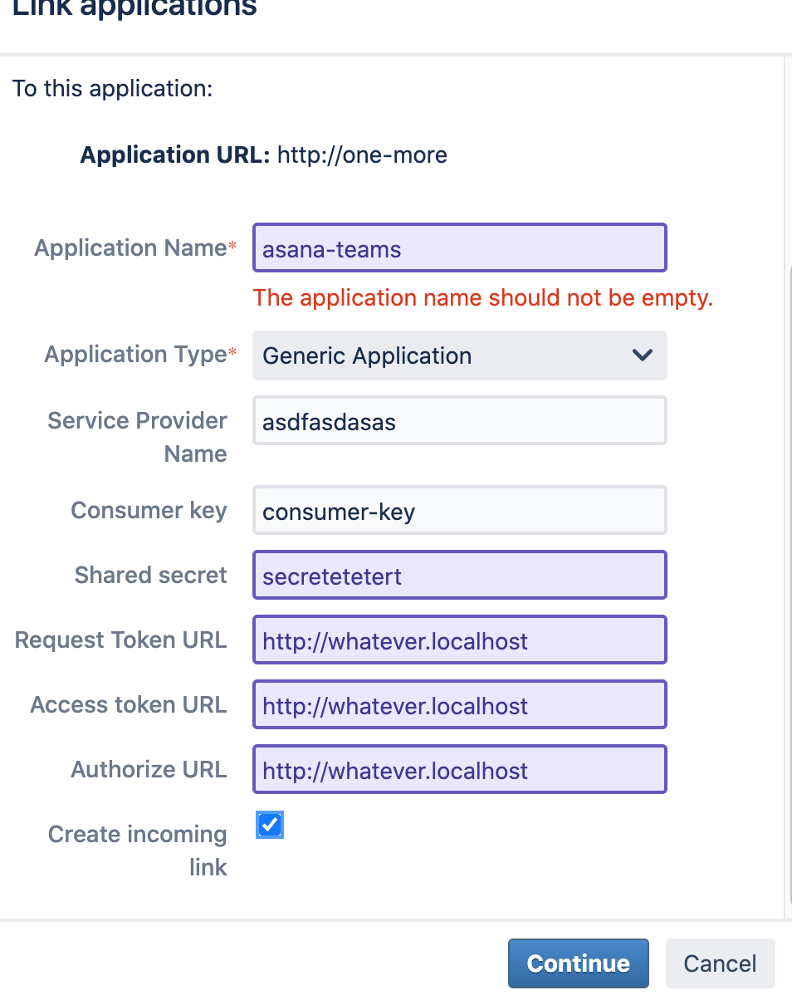

# How to add an application link

Some Jira server instances prohibit the requests that the plugin makes to create application links. In this case they should be created/edited manually:

- Open the applications menu 
- Open the application links menu 
- Find or create an application link in Jira which starts with "AsanaAppLink-", for example 
- Edit it, find "Incoming Authentication", then "delete" if there is anything then fill in the fields below.
- Try authentication from the Asana (adding it to the specific project).

*Question:* On create a new app link but the setup requests a Request token URL, Access Token URL and a Authorize URL. Do you happen to know which values we need to add here?

*Answer:* The only part that matters for the Asana → Jira Server connectivity is the "Incoming" part of the application link.
So when creating manually, any value could be used for the fields on the first screen. They could be "http://whatever.localhost" 
The values with the credentials should be put on the next screen. 

After that - optionally but recommended - the "Outgoing authentication" part (from Jira to Asana) could be deleted, as on the last screenshot: 
