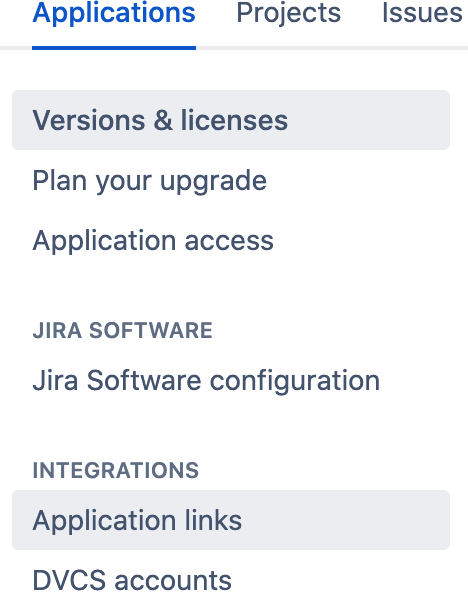

# How to set up OAuth2 credentials for Jira Server

Jira Server version 8.22 or [higher supports OAuth2](https://jira.atlassian.com/browse/JRASERVER-43171) for incoming connections.
The flow allows third party applications to make requests to the Jira Server on the user's behalf.
Previous versions of Jira Server allowed only OAuth1.0a flow. 

OAuth2 is the industry-standard protocol. [Here is an example](https://oauth.net/2/)
of documentation for it.

## Generate the application link credentials on the Jira Server following the steps:

- Open the applications menu 

- Open the application links menu

- Сreate a new incoming application link with these parameters
- 
- 
- 
- `https://jira-api.integrations.asana.plus/setup/callback/jira`
- Hit the "Save" button.
- The resulting page should look 
- Don't close the page yet.

## Set up the integration using the credentials

- Open the [main page](https://jira-api.integrations.asana.plus/setup)
- Log in as Asana user, press "Allow" (log in would involve Asana OAuth process and should look )
- Select an Asana workspace from  
- Fill all the fields in the form like , use the values generated by Jira Server previously and press "Connect".
- Note that the Jira Server should be accessible from the internet, other scenarios like internal dns names are not supported for the moment. 
- It will start the Jira Server OAuth2 flow, press "Allow" button 
- If everything is ok, you would be redirected to a page where the oauth2 process will finish.
- As a result, the current access and refresh tokens will be stored by the integration.
- As a user, you should see the screen .

## What's next?

- You could delete the connection that is stored by the integration, press "Remove" button
- You could select another Asana workspace and use the same application link credentials if the Jira Server stays the same.

## What could go wrong?

- A typo in the Jira Server url.
  - Non-existing will be detected as "Not accessible" on save.
  - Existing dns name visible from browser to the user but not accessible from other internet addresses are not supported for now. 
- A typo in the client id.
  - The error looks 
  - Solution is to use "Back" button in the browser and check the client id value
- A typo in the client secret
  - The error looks 
  - Solution is to click on the "Go to settings" button and fix the parameter.
- A typo in the callback
  - The error looks 
  - Solution is to go back to the create app link and create a new one, then copy the new credentials.
