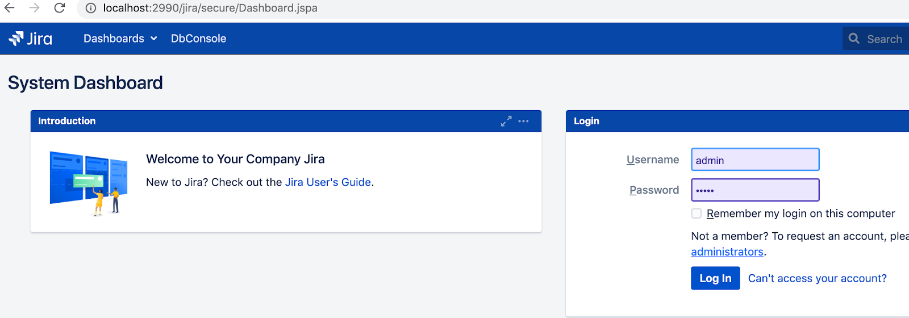
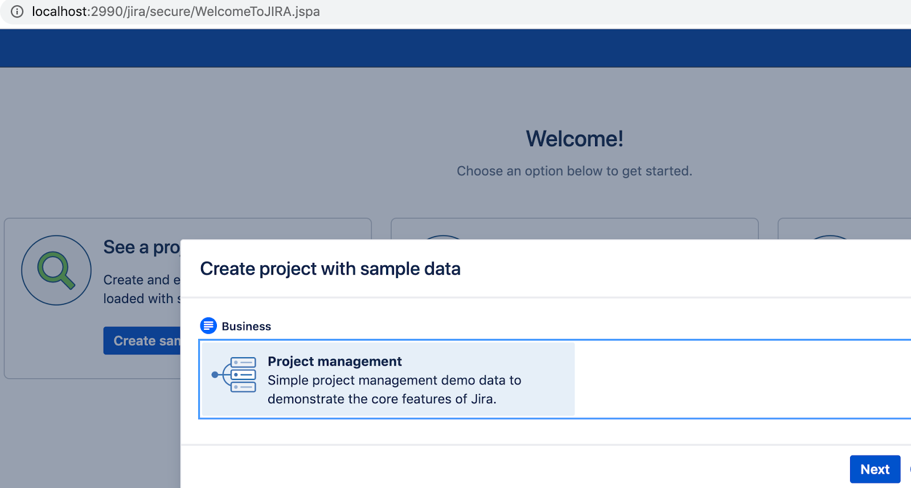
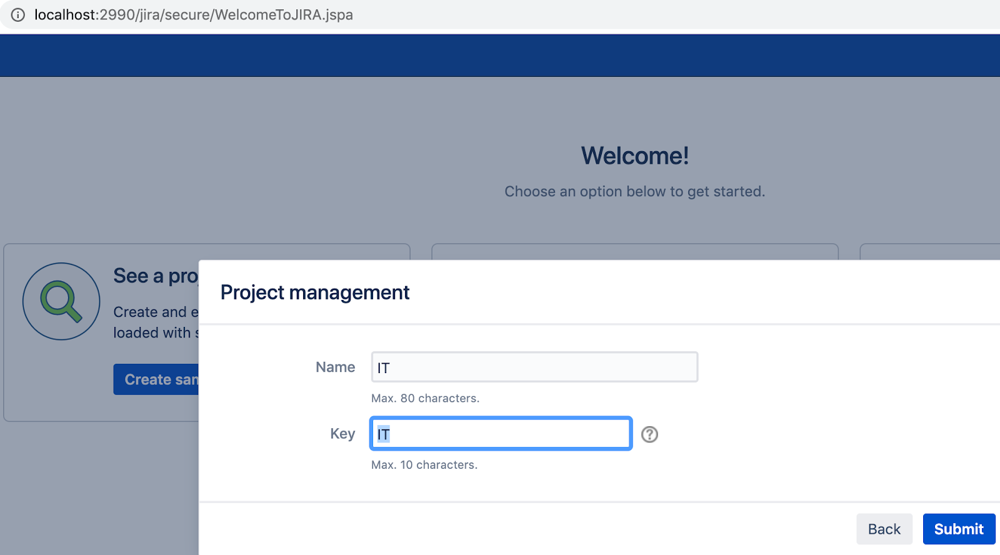
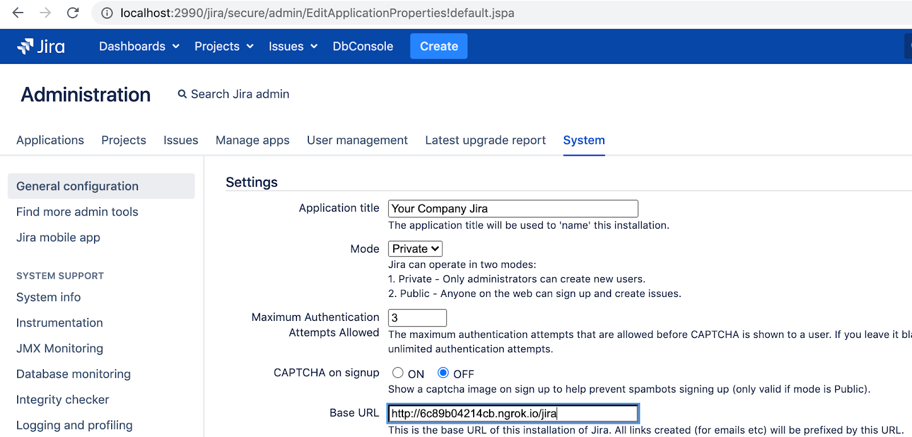
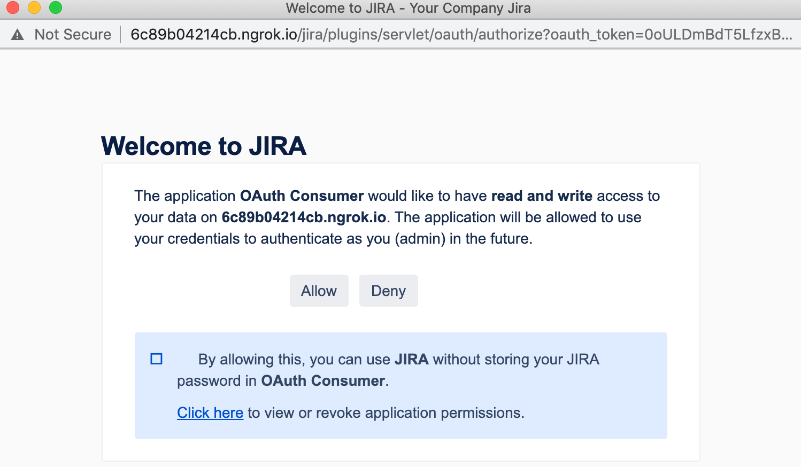
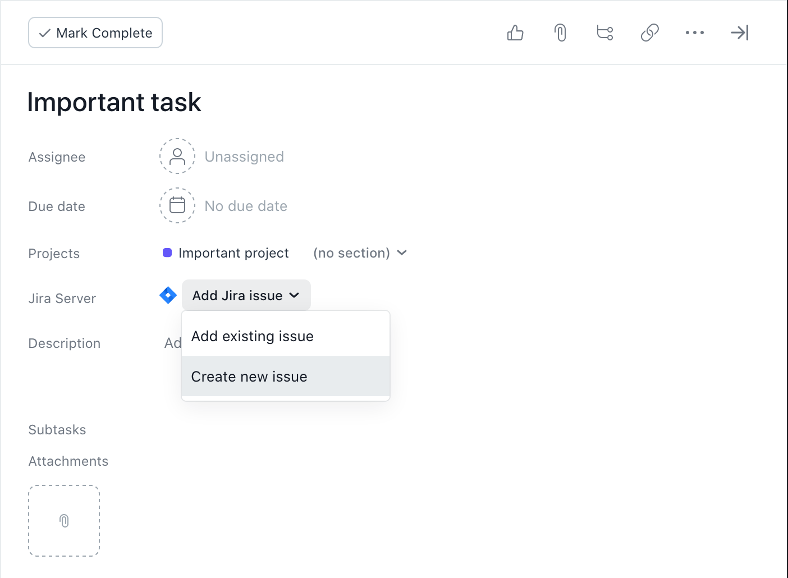
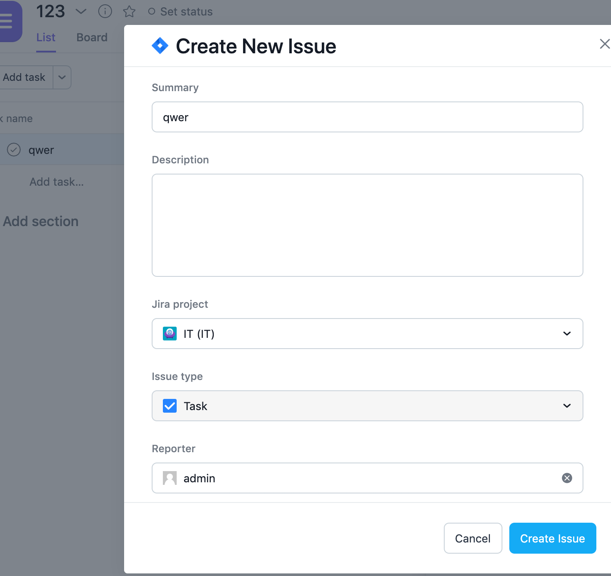
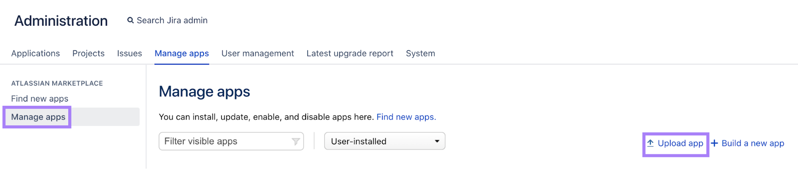
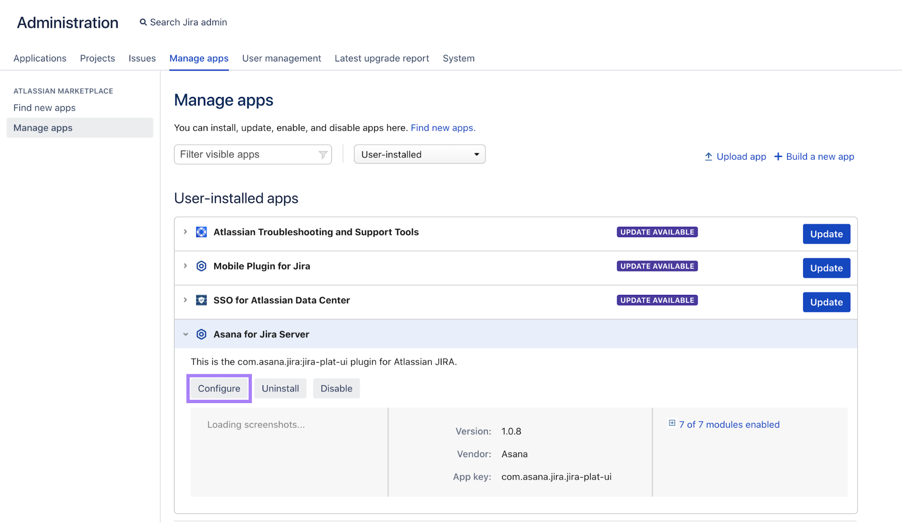
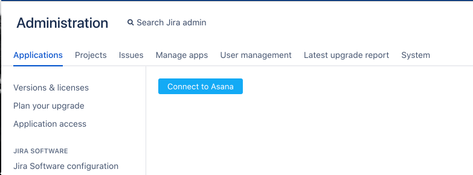

### Notes:
jira-server integration does not support authentication via 3rd party authenticcation services (e.g. okta, microsoft auth...) 

# Asana for Jira Server: Admin Guide

Welcome to the Asana for Jira Server Admin Guide! Here we will help you identify if your Jira Server configuration is 
compatible with the **Asana for Jira Server Integration** and walk through a few common configuration scenarios that 
might help you troubleshoot getting set up.

Note that every Jira Server deployment can be configured differently, so while the Asana for Jira Server Integration 
supports a number of different configurations, not all Jira Servers will be capable of working with the integration. 
Before we move forward, here are some requirements that should help you determine if your Jira Server will be compatible
with the integration:

# Requirements
## 1. You are using a supported version of Jira Server

Currently, the Asana integration supports the following version of Jira Server: 7.13.5 - 8.21.1.
* [Jira Software release notes](https://confluence.atlassian.com/jirasoftware/jira-software-release-notes-776821069.html)

It is possible that other versions of Jira Server will work with the integration, and we do not explicitly restrict the 
integration from being used with other Jira Server 8 versions. However, keep in mind that these are the 
versions that we test against and you may experience unexpected issues with other versions.

## 2. Your Jira Server’s Rest API is accessible to the integration via HTTPS

The Asana integration is a cloud-based service that securely communicates with your Jira Server’s 
[REST API](https://developer.atlassian.com/server/jira/platform/rest-apis/) via an 
[Application Link](https://confluence.atlassian.com/applinks/application-links-documentation-165120834.html). The 
following endpoints must be accessible to the integration via HTTPS (where “base_url” is your Jira Server’s 
[externally accessible](#3-your-jira-servers-dns-name-resolves-to-an-externally-valid-ip) hostname):

- `GET https://<base_url>/`
- `GET https://<base_url>/oauth_authorize`
- `GET https://<base_url>/oauth_token`
- `GET https://<base_url>/plugins/servlet/oauth/request-token`
- `GET https://<base_url>/plugins/servlet/oauth/authorize`
- `GET https://<base_url>/rest/api/2/issue`
- `GET https://<base_url>/rest/api/2/issue/createmeta`
- `GET https://<base_url>/rest/api/2/issue/${jiraIssueKey}/attachments`
- `GET https://<base_url>/rest/api/2/serverInfo`
- `POST https://<base_url>/asana_auth/create_applink`

If you’d like to specify the Asana integration on an “allow list” so that you can continue to restrict other external 
traffic to these endpoints, the integration will use the following static public IP address(can be changed, rarely)
which can be looked up by next DNS record:

- `jira-api-allowedlist.integrations.asana.plus` (or use 52.89.109.119 static IP)

## 3. Your Jira Server’s DNS name resolves to an externally valid IP

The Asana integration uses [OAuth](https://developer.atlassian.com/server/jira/platform/oauth/) to authenticate 
requests from individual users in your Jira Server instance. OAuth1 requires that each request includes a signature 
parameter that includes a valid hostname for your Jira Server. 

This means that the external DNS name for your Jira Server must resolve to an externally accessible IP address. If 
your Jira Server’s DNS name resolves to an IP address that is only accessible from a corporate intranet or VPN, you 
will not be able to install the Asana integration without making some DNS modifications.

If you are open to making those changes, check out [this section](#Configuring-DNS-resolution) of this guide.

# Common scenarios
## Configuring DNS resolution

It’s common for some Jira Servers to have a DNS name which actually resolves to an internal IP address that is only 
accessible from a corporate intranet or VPN.

This presents a problem for the Asana integration’s 
[OAuth requirements](#3-your-jira-servers-dns-name-resolves-to-an-externally-valid-ip). If you’re in this situation 
you have two paths forward:

##### Configure your DNS servers to resolve the same DNS name in different way for internal and external clients
This should be relatively straight forward. Say your Jira Server currently lives at `jira.example.com` . You’d have 
to configure your DNS server to resolve `jira.example.com` to one IP address for intranet users and another, 
externally valid IP for external internet users (like the Asana integration).

##### Use different DNS names for internal and external clients
In this situation, you’ll set up a separate DNS name to use with external clients like the Asana integration.

Let’s say that we have the following hostname: `https://jira.example.com:2991`. This hostname resolves to an IP addresses that are valid on your company intranet. For the sake of example, let’s say those IP addresses are:

- `172.31.68.196`
- `172.31.67.104`

What we’ll want to do is set up a different DNS name, say `https://jira-external.example.com:2990` to use with the 
Asana integration. We’ll do this by setting up a net work load balancer (NLB) that is configured to listen on a 
particular port and redirect to our two internal IP addresses `172.31.68.196` and `172.31.67.104`. Note that the NLB 
is just a TCP load balancer, it should not modify any headers and should forward requests unchanged to the internal IP 
addresses and with the same hostname.

Finally, you’ll have to modify your Jira Server configuration files to validate requests to a hostname that is 
different than the one that Jira is using as its base URL. This can be achieved by modifying the `server.xml` file in 
your Jira Server instance to include the following configuration:

```xml 
<?xml version="1.0" encoding="utf-8"?>
<Server port="{{ atl_tomcat_mgmt_port | default('8005') }}" shutdown="SHUTDOWN">
    <Service name="Catalina">
        <Connector scheme="{{ atl_tomcat_scheme | default(catalina_connector_scheme) | default('http') }}" proxyName="jira-externlb.integrations.asana.plus" proxyPort="2991" />
    </Service>
</Server>
```

For more details on where to place or find your `server.xml`, please consult this 
[article](https://confluence.atlassian.com/kb/reverse-proxy-and-application-link-troubleshooting-guide-719095279.html) 
in Atlassian’s documentation.

## Testing locally

It may be helpful to test the integration in a local staging environment before attempting to configure it with your 
production Jira Server instance.

1. Start your local server using [atlas-run](https://developer.atlassian.com/server/framework/atlassian-sdk/atlas-run/):
    ```text
    $ atlas-run
    [INFO] Starting jira on the tomcat8x container on ports 2990 (http), 52221 (rmi) and 8009 (ajp)
    [INFO] [talledLocalContainer] Tomcat 8.x started on port [2990]
    [INFO] jira started successfully in 377s at http://localhost:2990/jira
    [INFO] Type Crtl-C to shutdown gracefully
    ```
2. Use ngrok to start a tunnel your local server’s port:
    ```text
    $ ngrok http 2990
    ```
   This should output an alias similar to `http://ac385719247c.ngrok.io`
3. Navigate to http://localhost:2990/jira and login as a user with admin permissions.
    
4. Create a sample project in Jira
    
    
5. Go to the **Adminstration** panel and under **General configuration** set the Base URL to your ngrok alias + 
“/jira”. For example: http://ac385719247c.ngrok.io/jira
    
6. Install the Asana for Jira Server plugin (see [Installing the Plug-in](#installing-the-plug-in) for full instructions)

    If you receive an error stating that your “Jira URL isn’t accessible,” return to step 5
7. Navigate to an Asana project where you would like to install the Asana for Jira Server integration
    1. Click on the drop-down arrow next to your project header
    2. Select **Add apps**. If this isn’t an option for you, look to the top right of your project view for a button 
    called ‘Apps’ or ‘Customize’
    3. Select **_Jira Server_**
    4. You’ll be prompted by a full screen installation wizard
    5. Authorize your Jira Server account
    
    6. After you’ve authorized, open a task in your project and you should see a Jira Server field: Click it and 
    select **Create new issue** from the dropdown
    
8. A form should load allowing you to fill out the details of a new issue. If this was successful then you’ve correctly
configured the Asana for Jira Server integration for your local Jira Server instance.
    

# Installing the Plug-in
1. Download the plugin file from [the Atlassian marketplace](https://marketplace.atlassian.com/apps/1223378/asana-for-jira-server?hosting=server&tab=overview) or from this repository and install it by uploading at"Administration"/"Manage apps" (/plugins/servlet/upm) on your Jira Server.
2. Login to Jira Server, and navigate to the Administration section.
3. Navigate to ‘Manage apps, and click ‘Upload App’
    
4. Use ‘Choose File’ to select the .jar you just downloaded
5. Once the action is complete, click ‘Configure’ under ‘Asana for Jira Server’
    
6. Click ‘Connect to Asana’
    
7. This will open an authentication flow. Grant permissions, then select the correct Asana workspace to link to your 
Server.
8. You’ll see a success page - Server side configuration is complete, and Asana users can now add the Jira Server 
integration to projects without further Server Admin support.

# Admin FAQ

##### What kind of authentication is used in Jira-Asana integration?
There are basically two phases of authentication between your Jira Server and the Asana integration: 

*Initial configuration of your Jira Server*
During the initial configuration of the integration, a Jira administrator installs the Asana Jira Server plugin, logins to Asana via OAuth2 and selects their Asana workspace. The plugin then makes a series of requests to Asana endpoints. One of these requests uses the administrator's credentials to create an Application Link in your Jira Server. An Application link is a way of registering a shared private/public key pair that allows the 3rd party integrations (like Asana's) to validate and secure requests made to your Jira Server's REST API. If a request is sent to your Jira Server's REST API that doesn't include a key matching one registered with an known Application Link, Jira Server will reject the request. So you can think of this step as performing the initial handshake that lets the Asana integration and Jira Server talk to each other securely. 

*Day to day use with OAuth1*
Once the initial handshake is performed, the Asana integration can make requests to your Jira Server's REST API, but that doesn't necessarily mean it can now use the API to read or modify data in your Jira Server instance because Jira Server's REST API has it's own user-based authentication model based on OAuth1. This means that while the Asana integration can now reach your Jira Server, users who want to create or read Jira issues from the integration will need to grant the integration access by authenticating using their Jira Server account.

This is done through a standard OAuth1 flow, that Atlassian has documented here (where you can replace "Your client" in the chart provided with "the Asana integration"): https://developer.atlassian.com/server/jira/platform/oauth

As you can see there, when the flow is complete, your Jira Server grants the Asana integration an access token and refresh token scoped to the Jira Server user going through the flow. Each user of the Asana integration will have go through this authentication flow individually. The Asana integration securely stores each user's tokens in its database and uses them to make requests to your Jira Server's REST API on behalf of that authenticated user. So now, after an admin has configured the integration AND the user has authenticated with the integration using their Jira Server account, the user can create and read issues in Jira Server from Asana.

##### Why is this integration not available through the Jira Server Marketplace?
Given the planned deprecation of Jira Server, we wanted to make the integration available as soon as possible instead 
of working through marketplace approval. That being said, we are continuing to work with Atlassian, and anticipate 
being available in the marketplace in early 2021.

##### Can I test this before deploying in my production Server instance?
Yes - we’ve added instructions above for how we recommend setting up the integration for local testing, but other 
options are available. Unfortunately, we cannot offer support for this flow beyond what we’ve provided above. 

##### Why does the Jira Server Admin need an Asana account?
Asana needs to know the exact Server domain, and connecting to Asana from with Jira ensures the integration has the 
correct destination for requests. 

##### How will I receive and deploy new versions of this integration?
New versions will be posted in this repository [in the packages section](https://github.com/orgs/Asana/packages?repo_name=jira-server-plugin). [Fill out this form](https://form-beta.asana.com?k=rb2W3EqNsfbzJnHeOruicw&d=15793206719)
if you’d like to be notified when new versions are available.

##### My team doesn’t have the time to handle the Server configuration. Does Asana offer additional support here? 
Yes - Asana currently works with an external partner who can be contracted for implementation support if required. 
Please reach out [here](https://asana.com/support) to explore options.

##### Attachments from Asana aren’t appearing in Jira server as expected - why?
* Currently, only Asana Attachments (where the asset is uploaded directly to Asana) can be fetched and attached to Jira issues. Linked files from Dropbox, Google Drive, etc. are expected to be ignored as they might require additional authorization.

* User permissions must be set for that user to attach files. An easy way to test this is to have the user attempt to 
add an attachment to a task. If that is the issue, you can update permissions following the 
[steps in this community thread](https://community.atlassian.com/t5/Questions-for-Confluence/User-permissions-add-attachments/qaq-p/24287).

##### After successful setting up of my Asana Domains the list is not shown on the plugin page. What should I do?
We are investigation the cause of this but for now there is a workaround: repeat the connection steps for the same domain. It will keep existing Jira issues and their relations to Asana tasks. The list of the connections will appear again.

##### I have two Jira servers and want to use both of them with the same Asana workspace
This configuration is not supported at the moment. You can set up only one Jira server with an Asana workspace.

# Getting further help
If you have further questions, get in contact with us [here](https://asana.com/support).
